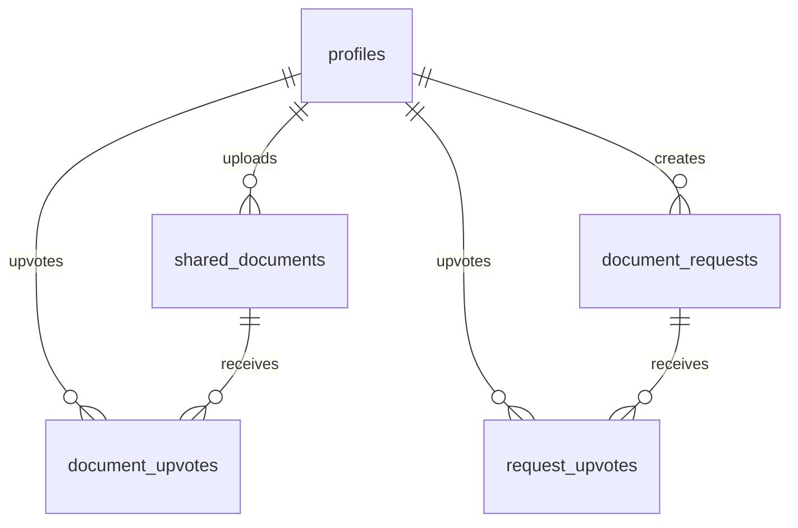

# AI Study Planner — Design & Architecture Specifications

Welcome to the **GKVK AI Study Planner & Community Hub** design reference document. This specification outlines the visual design language, theme configurations, database schemas, and storage layouts built into the application.

---

## 🎨 Visual Identity & Theme System

The app utilizes a modern, dark-mode first **glassmorphic design system** with vibrant accents, subtle gradients, and floating card elements to provide a premium user experience.

### 1. Color Palette (Tailwind Tokens)
Our theme is built using dynamic dark-mode values that harmonize with natural agricultural elements (Emerald/Sage) and AI-themed accents (Vibrant Purple).

| Token Name | Value / Tailwind Class | Visual Purpose |
| :--- | :--- | :--- |
| **Primary Accent** | `#8B5CF6` / `text-primary` | Main focus actions, upvotes, and key buttons. |
| **Secondary Accent** | `#3B82F6` / `text-secondary` | AI status indicators and collaboration features. |
| **Background (Deep)** | `#0B0F19` / `bg-background` | Viewport backdrop. |
| **Surface Card** | `bg-surface-container-low` | Dashboard widget containers and note grid cards. |
| **Glass border** | `border-muted-foreground/10` | Micro-borders to define card shapes over gradients. |

### 2. Category Color Mappings
Badges and course descriptors dynamically display themed borders and background glows based on topic areas:
*   **Exam Papers:** `bg-cyan-500/10 text-cyan-400 border-cyan-500/20`
*   **Lecture Notes:** `bg-purple-500/10 text-purple-400 border-purple-500/20`
*   **Study Guides:** `bg-emerald-500/10 text-emerald-400 border-emerald-500/20`
*   **Practice Sheets:** `bg-amber-500/10 text-amber-400 border-amber-500/20`

---

## 📐 Layout & Page Hierarchy

The app follows a master-detail responsive grid structure wrapped inside a unified sidebar layout.

```
+-------------------------------------------------------------+
|  [Logo] GKVK AI  |  [Header] Search...           [500 CR]   |
+------------------+------------------------------------------+
|  Browse All      |  +------------------------------------+  |
|  Lecture Notes   |  | GKVK Community Hub                 |  |
|  Exam Papers     |  | Notes & Papers Sharing Hub         |  |
|  Requests Board  |  +------------------------------------+  |
|                  |  | Community   | Total     | Pending   |  |
|  | Uploads       | Downloads | Requests  |  |
|                  |  +------------------------------------+  |
|  [User Account]  |  | [Grid] Note Card | Note Card | Note  |  |
+------------------+------------------------------------------+
```

### Key Layout Wrappers
1.  **Sidebar (`layout.jsx`):** Uses shadcn `SidebarProvider` to house the navigation controls on the left.
2.  **Toned Down LightRays Backdrop:** A subtle, low-opacity (`opacity-20`) dark indigo (`#312e81`) animated overlay placed directly behind panels to give depth without distraction.
3.  **Responsive Grid (`share/page.jsx`):** Employs `grid-cols-1 md:grid-cols-2 lg:grid-cols-3` to align notes grids gracefully from phone viewports up to large desktop monitors.

---

## ⚡ Micro-Interactions & Animations

We use `motion/react` (Framer Motion) and MagicUI keyframe elements to drive responsive feedback that makes the user interface feel alive.

*   **Study Set Cards (BorderBeam):** Integrates two staggered `BorderBeam` highlights (`size={160}`, delayed by 4s) orbiting in opposite loops to outline cards dynamically.
*   **Resource Cards (ShineBorder):** Employs MagicUI `ShineBorder` (`borderWidth={1.5}`, `duration={10}`) with a purple-to-blue gradient shine running along the card boundaries.
*   **Upload Progress:** Interactive steps (malware scans, metadata compile) are animated sequentially with a loader bar to mimic actual AI file digestion.
*   **Modals:** Drop down and fade in (`initial={{ opacity: 0, scale: 0.95, y: 15 }}`) for a smooth, hardware-accelerated transition.

---

## 🗄️ Database & Storage Architecture

The backend utilizes **Supabase PostgreSQL** and **Supabase Object Storage** to run notes sharing, download logging, and upvoting logic.

### 1. Database Schema Relationship Map



### 2. Dual Storage Bucket Routing
We use two separate buckets to divide document ingestion loads:

*   📂 **`study-materials`**:
    *   *Task:* Stores files uploaded for private **AI Study Set generation**.
    *   *Access Policy:* Restricted to the user who uploaded the document (private access).
*   📂 **`notes-sharing-materials`**:
    *   *Task:* Stores files uploaded to the public **Notes & Papers Sharing Hub**.
    *   *Access Policy:* Publicly read-accessible to all authenticated GKVK scholars, with write permissions restricted to the uploader.
